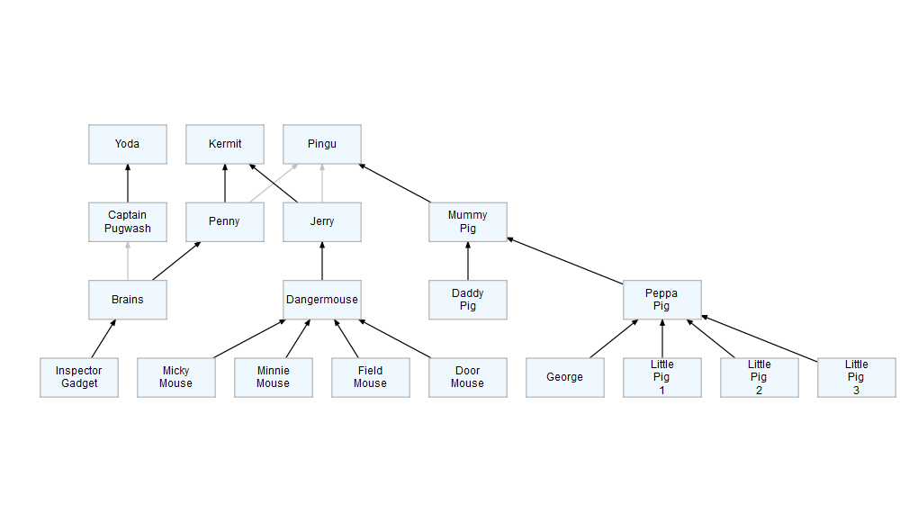

<!-- README.md is generated from README.Rmd. Please edit that file -->

# orgcharter

<!-- badges: start -->
<!-- badges: end -->

The goal of orgcharter is to help make simple organisation charts, to
help you communicate your organisation’s structure to those who need to
understand it.  
Often, that is the people who work within it!

This package is a convenient wrapper around the
[{DiagrammeR}](https://github.com/rich-iannone/DiagrammeR) package. If
you are interested in understanding more or extending this package, that
is a very good place to start.

## Installation

Install from [GitHub](https://github.com/) with:

``` r
# install.packages("remotes")
remotes::install_github("ThomUK/orgcharter")
```

## Getting Started

This is a minimal example showing how to build a basic org chart:

``` r
library(orgcharter)

## First you'll need some organisation data
## Often, that will be from a spreadsheet, but to demonstrate, we will do it in code
## 3 Columns are mandatory, because they define the nodes and edges in the chart

data <- tibble::tribble(
  ~`Team Member`,       ~Manager,             ~`Reporting Line`,
  "Dangermouse",        "Jerry",              "solid",
  "Micky Mouse",        "Dangermouse",        "solid",
  "Minnie Mouse",       "Dangermouse",        "solid",
  "Field Mouse",        "Dangermouse",        "solid",
  "Door Mouse",         "Dangermouse",        "solid",
  "Peppa Pig",          "Mummy Pig",          "solid",
  "George",             "Peppa Pig",          "solid",
  "Little Pig 1",       "Peppa Pig",          "solid",
  "Little Pig 2",       "Peppa Pig",          "solid",
  "Little Pig 3",       "Peppa Pig",          "solid",
  "Daddy Pig",          "Mummy Pig",          "solid",
  "Inspector Gadget",   "Brains",             "solid",
  "Brains",             "Captain Pugwash",    "dotted",
  "Captain Pugwash",    "Yoda",               "solid",
  "Brains",             "Penny",              "solid",
  "Mummy Pig",          "Pingu",              "solid",
  "Penny",              "Pingu",              "dotted",
  "Jerry",              "Pingu",              "dotted",
  "Penny",              "Kermit",             "solid",
  "Jerry",              "Kermit",             "solid",
)

# Next, prepare the data
prepared_data <- prepare_org_data(data)

# Finally, make the org chart
make_org_chart(prepared_data)
```


